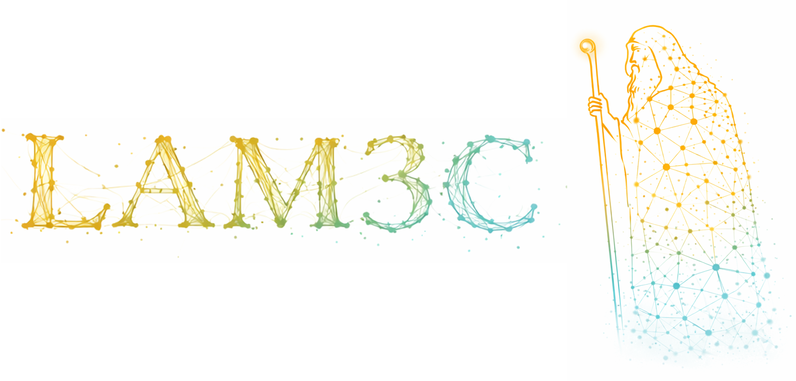
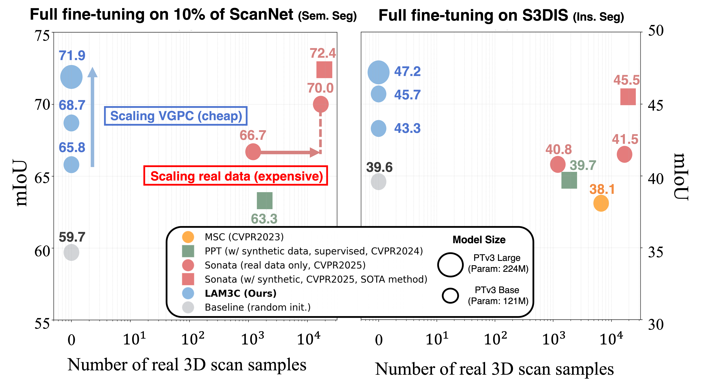
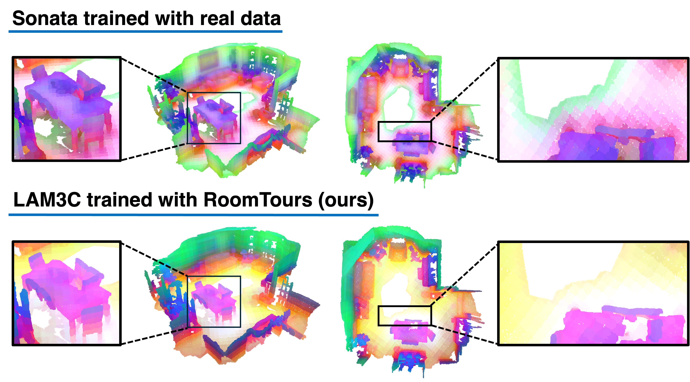

<p align="center">
    
</p>

<h1 align="center">3D <em>sans</em> 3D Scans: Scalable Pre-training from Video-Generated Point Clouds</h1>


<p align="center">
  <a href="https://arxiv.org/abs/2512.23042"></a>
  <a href=""></a>
  <a href=""></a>
  <a href="https://huggingface.co/aist-cvrt/lam3c-roomtours"></a>
   <a href=""></a>
</p>

---

This repository contains the official implementation of LAM3C and the RoomTours pipeline.

> ### LAM3C Message
> The bottleneck of 3D self-supervised learning is not only algorithms, but also the scarcity of large-scale 3D data.  
> By turning the vast sea of unlabeled internet videos into point clouds, we unlock a scalable source of 3D supervision.




## TL;DR
This paper shows that 3D self-supervised learning can be trained using only video-generated point clouds reconstructed from unlabeled videos, without relying on real 3D scans.

We introduce:

- **RoomTours** — a scalable pipeline that converts unlabeled indoor videos into video-generated point clouds.
- **LAM3C** — a 3D self-supervised learning framework designed to learn robust representations from noisy video-generated point clouds.

LAM3C transfers well to indoor semantic and instance segmentation tasks.


## News

- Mar 2026: Released RoomTours generation code and inference demo visualization.
- Feb 2026: LAM3C was accepted to **CVPR 2026 (main track)**.


## Overview

- [Installation](#installation)
- [Quick Start](#quick-start)
- [Model Zoo](#model-zoo)
- [Experiment Logs](#experiment-logs)
- [RoomTours Pipeline](./roomtours_gen/README.md)
- [Citation](#citation)


## Requirements

- Conda
- Python 3.9
- PyTorch 2.5.0
- CUDA 12.4
- NVIDIA GPU for CUDA execution

## Installation

This repo provide two ways of installation: **standalone mode** and **package mode**.

- The **standalone mode** is recommended for users who want to use the code for quick inference and visualization. We provide a most easy way to install the environment by using `conda` environment file. The whole environment including `cuda` and `pytorch` can be easily installed by running the following command:
  ```bash
  # Create and activate conda environment named as 'lam3c'

  # run `unset CUDA_PATH` if you have installed cuda in your local environment
  conda env create -f environment.yml --verbose
  conda activate lam3c

  # if torch-scatter installation fails, install explicitly from the PyG wheel index
  pip install --no-build-isolation torch-scatter -f https://data.pyg.org/whl/torch-2.5.0+cu124.html

  # optional: install FlashAttention after torch is available in this env
  # (required on some systems to avoid pip build-isolation issues)
  pip install --no-build-isolation git+https://github.com/Dao-AILab/flash-attention.git
  ```

  *FlashAttention is optional. If installation fails in your environment, you can skip it and use the fallback path (see Model section in [Quick Start](#quick-start)).*

- The **package mode** is recommended for users who want to inject our model into their own codebase. We provide a `setup.py` file for installation. You can install the package by running the following command:
  ```bash
  # Ensure Cuda and Pytorch are already installed in your local environment

  # CUDA_VERSION: cuda version of local environment (e.g., 124), check by running 'nvcc --version'
  # TORCH_VERSION: torch version of local environment (e.g., 2.5.0), check by running 'python -c "import torch; print(torch.__version__)"'
  pip install spconv-cu${CUDA_VERSION}
  pip install --no-build-isolation torch-scatter -f https://data.pyg.org/whl/torch-{TORCH_VERSION}+cu${CUDA_VERSION}.html
  # optional:
  pip install --no-build-isolation git+https://github.com/Dao-AILab/flash-attention.git
  pip install huggingface_hub timm

  # (optional, or directly copy the lam3c folder to your project)
  python setup.py install
  ```
  Additionally, for running our **demo code**, the following packages are also required:
  ```bash
  pip install open3d fast_pytorch_kmeans psutil numpy==1.26.4  # currently, open3d does not support numpy 2.x
  ```


## Quick Start

Let's first begin with simple visualization demos with LAM3C, our pre-trained PointTransformerV3 (PTv3) model.

### Visualization


We provide demos for PCA feature visualization, similarity heatmaps, semantic segmentation, and batched forward inference in the `demo` folder.

```bash
# 1) activate environment
conda activate lam3c
unset PYTHONPATH
export PYTHONNOUSERSITE=1
export PYTHONPATH=./

# 2) (optional) headless output on servers (writes .ply files to outputs/)
# export LAM3C_HEADLESS=1

# 3-A) recommended: run with HuggingFace checkpoints
# default model size is large
python demo/0_pca.py --hf-repo-id aist-cvrt/lam3c-roomtours
python demo/1_similarity.py --hf-repo-id aist-cvrt/lam3c-roomtours
python demo/2_sem_seg.py --hf-repo-id aist-cvrt/lam3c-roomtours
python demo/3_batch_forward.py --hf-repo-id aist-cvrt/lam3c-roomtours

# switch to base model size on HuggingFace
python demo/0_pca.py --hf-repo-id aist-cvrt/lam3c-roomtours --model-size base
python demo/1_similarity.py --hf-repo-id aist-cvrt/lam3c-roomtours --model-size base
python demo/2_sem_seg.py --hf-repo-id aist-cvrt/lam3c-roomtours --model-size base
python demo/3_batch_forward.py --hf-repo-id aist-cvrt/lam3c-roomtours --model-size base

# 3-B) fallback option: run with local preset checkpoints
# Use this when HF access is unavailable or blocked.
# Place the 4 checkpoint files under weights/ with names listed in "Model Zoo".
# Note: legacy checkpoint names ending with "_scennet.pth" are also supported.
python demo/0_pca.py --model-size base --ckpt weights/lam3c_ptv3-base_roomtours49k.pth
python demo/0_pca.py --model-size large --ckpt weights/lam3c_ptv3-large_roomtours49k.pth
python demo/1_similarity.py --model-size base --ckpt weights/lam3c_ptv3-base_roomtours49k.pth
python demo/1_similarity.py --model-size large --ckpt weights/lam3c_ptv3-large_roomtours49k.pth
python demo/2_sem_seg.py --model-size base --ckpt weights/lam3c_ptv3-base_roomtours49k.pth --head-ckpt weights/lam3c_ptv3-base_roomtours49k_probe-head_scannet.pth
python demo/2_sem_seg.py --model-size large --ckpt weights/lam3c_ptv3-large_roomtours49k.pth --head-ckpt weights/lam3c_ptv3-large_roomtours49k_probe-head_scannet.pth
python demo/3_batch_forward.py --model-size base --ckpt weights/lam3c_ptv3-base_roomtours49k.pth
python demo/3_batch_forward.py --model-size large --ckpt weights/lam3c_ptv3-large_roomtours49k.pth

# 3-C) run with custom checkpoints
python demo/0_pca.py --ckpt /path/to/custom_backbone.infer.pth
python demo/2_sem_seg.py --ckpt /path/to/custom_backbone.infer.pth --head-ckpt /path/to/custom_linear_head.pth
```

### Inference on custom data

Moved to [`demo/README.md`](./demo/README.md) for easier access while working in the `demo` folder.


## Model Zoo

Download checkpoints from Google Drive and place them under `weights/` for local execution.  
For HuggingFace-based loading in the examples below, use repo id `aist-cvrt/lam3c-roomtours`.

**LP** = linear probing. **FT** = full fine-tuning.

### Pretrained Backbones & Benchmark Results

<table>
<thead>
<tr>
<th>Model</th>
<th>Backbone</th>
<th>Checkpoint</th>
<th>Pretraining Data</th>
<th colspan="2" align="center">ScanNet</th>
<th colspan="2" align="center">ScanNet200</th>
<th colspan="2" align="center">ScanNet++ Val</th>
<th colspan="2" align="center">S3DIS Area 5</th>
<th>Weights</th>
<th>Logs</th>
</tr>

<tr>
<th></th>
<th></th>
<th></th>
<th></th>
<th align="center">LP</th>
<th align="center">FT</th>
<th align="center">LP</th>
<th align="center">FT</th>
<th align="center">LP</th>
<th align="center">FT</th>
<th align="center">LP</th>
<th align="center">FT</th>
<th></th>
<th></th>
</tr>
</thead>

<tbody>

<tr>
<td>LAM3C</td>
<td>PTv3-Base</td>
<td><code>lam3c_ptv3-base_roomtours49k.pth</code></td>
<td>RoomTours49k (VGPC)</td>
<td align="center">66.0</td>
<td align="center">75.1</td>
<td align="center">25.3</td>
<td align="center">35.1</td>
<td align="center">34.2</td>
<td align="center">43.1</td>
<td align="center">65.7</td>
<td align="center">72.9</td>
<td>
<a href="https://drive.google.com/file/d/1hUK7JMZ_eTzFUDUasvJLeQkomD3SIHR3/view?usp=drive_link">Google Drive</a><br>
<a href="https://huggingface.co/aist-cvrt/lam3c-roomtours">HuggingFace</a>
</td>
<td><a href="docs/experiment_logs.md#ptv3-base">details</a></td>
</tr>

<tr>
<td>LAM3C</td>
<td>PTv3-Large</td>
<td><code>lam3c_ptv3-large_roomtours49k.pth</code></td>
<td>RoomTours49k (VGPC)</td>
<td align="center">69.5</td>
<td align="center"><b>79.5</b></td>
<td align="center">28.1</td>
<td align="center">35.5</td>
<td align="center">35.9</td>
<td align="center">43.1</td>
<td align="center">69.5</td>
<td align="center"><b>75.5</b></td>
<td>
<a href="https://drive.google.com/file/d/1hUK7JMZ_eTzFUDUasvJLeQkomD3SIHR3/view?usp=drive_link">Google Drive</a><br>
<a href="https://huggingface.co/aist-cvrt/lam3c-roomtours">HuggingFace</a>
</td>
<td><a href="docs/experiment_logs.md#ptv3-large">details</a></td>
</tr>

</tbody>
</table>

### Linear Probe Heads

| Head | Backbone | Checkpoint | Target Dataset | Weights |
| --- | --- | --- | --- | --- |
| ScanNet linear probe head | PTv3-Base | `lam3c_ptv3-base_roomtours49k_probe-head_scannet.pth` | ScanNet | [Google Drive](https://drive.google.com/file/d/1hUK7JMZ_eTzFUDUasvJLeQkomD3SIHR3/view?usp=drive_link)<br>[HuggingFace](https://huggingface.co/aist-cvrt/lam3c-roomtours) |
| ScanNet linear probe head | PTv3-Large | `lam3c_ptv3-large_roomtours49k_probe-head_scannet.pth` | ScanNet | [Google Drive](https://drive.google.com/file/d/1hUK7JMZ_eTzFUDUasvJLeQkomD3SIHR3/view?usp=drive_link)<br>[HuggingFace](https://huggingface.co/aist-cvrt/lam3c-roomtours) |

A single pretrained backbone is evaluated across multiple downstream datasets.  
See [detailed experiment logs](docs/experiment_logs.md) for dataset-wise training and evaluation logs.

## Experiment Logs

Detailed dataset-wise training and evaluation logs are available in:

- [`docs/experiment_logs.md`](docs/experiment_logs.md)

## RoomTours Pipeline

RoomTours converts unlabeled indoor videos into training-ready point clouds for LAM3C pre-training.
The pipeline includes video download, scene segmentation, Pi3 reconstruction, and point-cloud preprocessing.
For setup and commands, see [`roomtours_gen/README.md`](./roomtours_gen/README.md).


## Citation

If you find our LAM3C work useful, please cite:

```bibtex
@inproceedings{yamada2026lam3c,
  title={3D sans 3D Scans: Scalable Pre-training from Video-Generated Point Clouds},
  author={Ryousuke Yamada and Kohsuke Ide and Yoshihiro Fukuhara and Hirokatsu Kataoka and Gilles Puy and Andrei Bursuc and Yuki M. Asano},
  booktitle={Proceedings of the IEEE/CVF Conference on Computer Vision and Pattern Recognition (CVPR)},
  year={2026}
}
```
```bib
@inproceedings{wu2025sonata,
    title={Sonata: Self-Supervised Learning of Reliable Point Representations},
    author={Wu, Xiaoyang and DeTone, Daniel and Frost, Duncan and Shen, Tianwei and Xie, Chris and Yang, Nan and Engel, Jakob and Newcombe, Richard and Zhao, Hengshuang and Straub, Julian},
    booktitle={CVPR},
    year={2025}
}
```
```bib
@misc{pointcept2023,
    title={Pointcept: A Codebase for Point Cloud Perception Research},
    author={Pointcept Contributors},
    howpublished={\url{https://github.com/Pointcept/Pointcept}},
    year={2023}
}
```

## License

- **Code:** MIT License.
- **LAM3C weights:** Creative Commons BY-NC 4.0 (free for research/education, **no commercial use**).
- **RoomTours / generated data:** Creative Commons BY-NC 4.0 (free for research/education, **no commercial use**).
- **Demo sample data:** loaded from Pointcept's `pointcept/demo` dataset repository on Hugging Face.
- **Upstream attribution:** This repository includes/adapts code from Sonata.

See `LICENSE`, `NOTICE`, and `THIRD_PARTY_NOTICES.md` for details.
